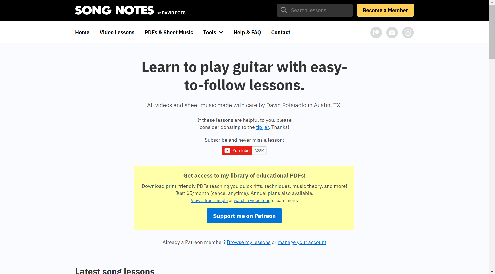
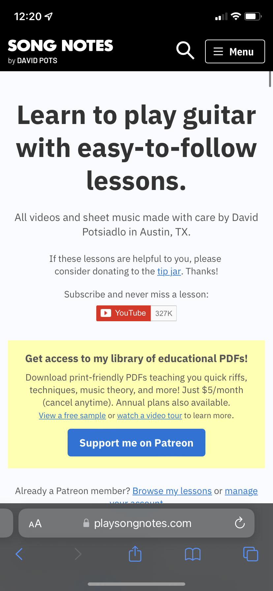
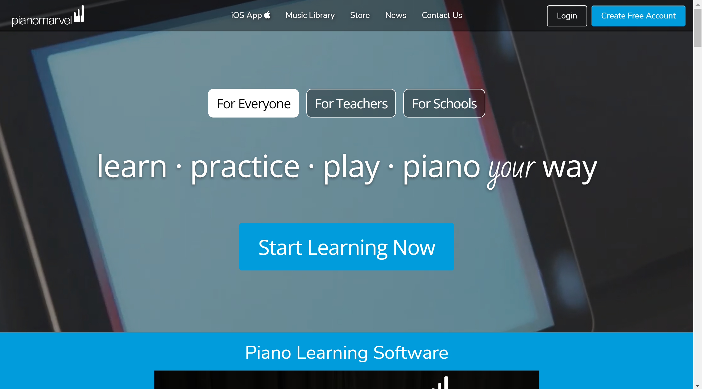
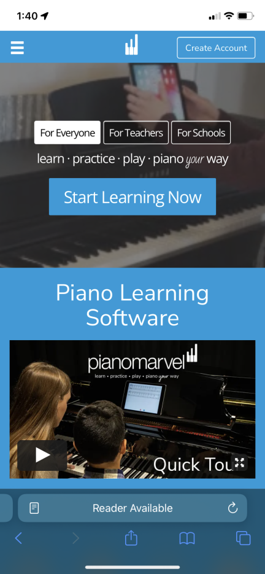

# Assignment 01: Heuristic Evaluation

### Capability of Online Learning in Musical Instruments

#### Tyler Nguyen | DGT HUM 110 | SPRING 2022

This course introduces the fields of UX research and design. It covers UX design methods, including ethnographic field research, persona-scenario development, information architecture, interface design, prototyping, and usability testing. Students will learn by hands-on practice in a human-centered process: how to understand users, how to design interfaces & interactions for users, and how to evaluate and communicate user experience design with users. (Dr. Sookie Cho)

### Description about the project how you want to contribute with your UX design

One of the leading methods of education today is learning online. The global COVID-19 pandemic has only led to an increased network prevalence in the age of modern technology. It results in many users turning to the internet to help supplement their learning. This project intends to address how well some websites perform in their accessibility and online presence for musical learning. It will also identify areas of improvement that can be easily implemented in the UX design of the website. 

This assignment will perform a heuristic evaluation (using Nielsen's heuristics) on two websites that are similar to the subject area of online musical learning. The severity rating will also be included in the analysis as well as additional comments on the user base.

## [Website 1: Play Song Notes](https://playsongnotes.com/)

*Information*: The website playsongnotes was created by musician David Pots. He covers lessons on YouTube with covers, practice tips, and updates that are posted to his website. The lessons are available for free with incentive to support the author on Patreon or donation to get the sheet music. The website can be used by anyone looking to play covers on the guitar or learn the basics. It is available to many demographics looking for quick helpful guitar lesson videos. David Pots himself is a middle-aged man.

*Overall Evaluation*: Playsongnotes.com is a simple functional website that offers many accessibility options for the user in a straightforward format. However, the unprofessional design of the website it apparent right away. It does not provide neat presentation, especially since the background is mostly white and the home page offers a lot of information right away. The title is plainly put in the middle and the social media links are oddly placed. The videos and organization of them are well designed, however, it may be overwhelming for the user at first. All in all, the website has a lot of good information, but, the user may consider spending more time navigating for what they truly want to learn.

### Heuristic evaluation

1. Visibility of System Status

> *My Definition* : The system should promptly update the user about the action of the website

**GOOD**: Has titles for header subpages for the reader to know where they are at on the website, but only if seen at the top of the page.

**BAD**: Clicking on a sub-page changes the user’s page but does not show which page they are on. The search bar doesn’t provide recommended song titles or suggestions. This may be useful for users to look up specific lessons or what they need easier.

*SEVERITY RATING*: 2 = Minor usability problem: fixing this should be given low priority

**POSSIBLE SOLUTION**: Implement a color change for each time the user changes the sub-page. In addition, the search bar can be expanded to include more recommendations and songs.

2. Match Between System & Real World

> *My Definition* : The information presented to the user is natural and easy to read for understanding

**GOOD**: The information and titles are easily read. “Video Lessons”, “PDF’s and Sheet Music”, and other headers are understandable, specifically for a middle-aged man.

**BAD**: Some musical terms may be hard for the user to know if they are a beginner.

*SEVERITY RATING*: 1 = Cosmetic problem only: need not be fixed unless extra time is available on project

**POSSIBLE SOLUTION**: For any unintuitive music terms, adding a link that shows the definition or providing more context for the phrase may help newer users.

3. User Control and Freedom

> *My Definition* : Clear user backwards accessibility and easy exit control for the user

**GOOD**: A lot of the information and links reappear throughout the page which can help users decipher where to go back to, however, this adds unneeded clunk to the pages.

**BAD**: If a user changes the page, there is no navigation to guide them back. When they enter something into the search bar, their history is not saved, in the case, they would lose their recent search.

*SEVERITY RATING*: 2 = Minor usability problem: fixing this should be given low priority

**POSSIBLE SOLUTION**: The website needs to specify when the user leaves the page or by adding a separate tab for those links. Implementation of an emergency back button may be very useful for searches and navigation.

4. Consistency and Standards

> *My Definition* : The readability and design of the website follow an order that does not confuse the user, such that, a similar button performs a regular action.

**GOOD**: Each subpage follows what is described to the user.

**BAD**: There are inconsistencies across the buttons on the main page and beyond. Sometimes the user may expect a button to be highlighted, instead, it redirects them to a different sub-page, and vice versa. Some links and buttons perform the same task but are different in visibility.

*SEVERITY RATING*: 2 = Minor usability problem: fixing this should be given low priority

**POSSIBLE SOLUTION**: Buttons should be designed for different outcomes. For example, a square button can be highlighted and selected, while a circle button can be a link to a different sub-page.

5. Error Prevention

> *My Definition* : System error is not common and is eliminated before the user makes an action.

**GOOD**: There are not many common errors because the website is designed without much user freedom.

**BAD**: There are no confirmation messages when the user makes a bad action. The search bar does not follow this guideline with a bad input of 0 results.

*SEVERITY RATING*: 1 = Cosmetic problem only: need not be fixed unless extra time is available on project

**POSSIBLE SOLUTION**: There needs to be more error checking for the user such that they are prompted before actions. Confirming the user’s email is a good check (confirmation by entering the email twice).

6. Recognition rather than recall

> *My Definition* : The design of the website helps the user remember possible options easily without having to recall past actions.

**GOOD**: When searching for something on the website, the system does a good job of reshowing the filters again for the user. There is good differentiation when a lesson is accessible through Patreon, donation, or free. The website is simple enough that navigation is not confusing and there is context behind the filters (in the search bar).

**BAD**: Going to different parts of the website may be confusing since there is no navigation guide. Video lessons sub-page makes it confusing to recall the past action of going to the page.

*SEVERITY RATING*: 1 = Cosmetic problem only: need not be fixed unless extra time is available on project

**POSSIBLE SOLUTION**: For the video lessons, there needs to be more expansion on what is on the Lessons page with context or more information.

7. Flexibility and Efficient Use

> *My Definition* : Provides the user the ability to fast cut different short cuts or speed up interactions based on the experience of the user.

**GOOD**: The search bar allows basic keyboard commands (ctrl + z, etc.).

**BAD**: There are no accessibility commands or shortcuts to change to the next song. Instead, the user needs to manually go back to the previous page and scroll to the next lesson (while remembering the correct header).

*SEVERITY RATING*: 1 = Cosmetic problem only: need not be fixed unless extra time is available on project

**POSSIBLE SOLUTION**: Adding additional arrow buttons that can help guide the user to change songs easier will help with efficient use of the design.

8. Aesthetic and Minimilistic design

> *My Definition* : Information that is trivial or blocking the simplistic design of the website should be removed.

**GOOD**: The information and video lessons are presented right away easy for the user to see on the main page.

**BAD**: The website does have any aesthetic design for the user to enjoy. The main page is clunky with a lot of useless information, such as the social media sites.

*SEVERITY RATING*: 3 = Major usability problem: important to fix, so should be given high priority

**POSSIBLE SOLUTION**: Simplifying the main page may help bring a more minimalist design. Also, moving the social media links to the contact page helps clean the clutter. It will make it easier to have better design this way.

9. Help Users with Errors

> *My Definition* : When something went wrong (technical or not), the website should promptly display an error message or explain simply the problem with help on further action.

**GOOD**: Signing up for the email newsletter prompts the user with an error when signing up with an invalid email address.

**BAD**: When entering invalid input into the search bar, the system does not help the user with correcting it. There is only a message that says 0 results found.

*SEVERITY RATING*: 1 = Cosmetic problem only: need not be fixed unless extra time is available on project

**POSSIBLE SOLUTION**: A message for invalid searches can show the user their invalid search. It may help to recommend something else or reveal the users search history on the website.

10. Help and Documentation

> *My Definition* : The website can help the user carry out their needs and actions through documentation to present additional context.

**GOOD**: A “Help & FAQ” is clearly presented to the user in the heading. The information is concise and easily understandable.

**BAD**: Any help information is not shown when the user makes a mistake, instead, they have to look at the sub-page in “Help & FAQ” to find a better solution.

*SEVERITY RATING*: 1 = Cosmetic problem only: need not be fixed unless extra time is available on project

**POSSIBLE SOLUTION**: Presenting the context of the problem right when the user needs it would be more efficient. When the user does not know where to access the PDF’s it should be shown at the page the user is currently on.

## [Website 2: Piano Marvel](https://pianomarvel.com/)

[PianoMarvel_Mobile](https://user-images.githubusercontent.com/40559762/162051519-293d0efa-cb46-4e42-8e01-15e8eb6bed08.png)

*Information*: The website promotes how it can help users at all levels learn the piano. They advertise their software on the website as well as on mobile devices (iPad). There are different levels of songs and learning programs for Everyone, Teachers, and Schools. It makes it seem simple to learn from Piano Marvel since they offer lessons online. However, the ability to learn comes at a cost and requires a profile and account with payment to use their program.

*Overall Evaluation*: Pianomarvel.com provides and professional user interface from its main page. It is easy to make an account and the user options are apparent. Some of the accessibility choices for the user may feel limited. It is too easy to navigate the website. There are not many headers. Instead, most of the information is crammed on the main page where the user needs to scroll down a lot. Overall, the website is clean and easy to look at with simple user tools to help navigate.!

### Heuristic evaluation

1. Visibility of System Status

> *My Definition* : The system should promptly update the user about the action of the website

**GOOD**: Does a good job of telling the user which sub-page they are on, however, it is small and on the far top-left (not easily visible). Includes easily seen log-in/create-an-account on the top left. The selections for different student/teacher/school is highlighted well when selected.

**BAD**: When clicking on one of the links, the website changes to another website. The user is not told that they are leaving the site. This makes the website not transparent to the user.

*SEVERITY RATING*: 3 = Major usability problem: important to fix, so should be given high priority

**POSSIBLE SOLUTION**: If the system decides to direct the user to another website, there needs to be a prompt for the user to accept. Otherwise, the website should just redirect the user to another sub-page with easily identifiable headers (can use colors schemes here).

2. Match Between System & Real World

> *My Definition* : The information presented to the user is natural and easy to read for understanding

**GOOD**: Simple straightforward headers are easily understandable. There is no complex or internal phrases. The information is easy to digest from the user perspective. Nothing abnormal or confusing that drew attention from parts of the website.

**BAD**: The Music library header is very generic and can be misinterpreted without context.

*SEVERITY RATING*: 1 = Cosmetic problem only: need not be fixed unless extra time is available on project

**POSSIBLE SOLUTION**: Changing the name of the header "Music Library" may help confused users of navigating to the sub-page. Possible names should be more simple, such as, "Library" or "Files".

3. User Control and Freedom

> *My Definition* : Clear user backwards accessibility and easy exit control for the user

**GOOD**: Navigation through the sub-pages are apparent with clicking back through the navigation history to exit some actions.

**BAD**: Some links navigate to a different website that loses the history of the previous main page.

*SEVERITY RATING*: 2 = Minor usability problem: fixing this should be given low priority

**POSSIBLE SOLUTION**: There needs to be a back button that links the user to a different page or at least suggests a prompt for the user to understand they are leaving the page.

4. Consistency and Standards

> *My Definition* : The readability and design of the website follow an order that does not confuse the user, such that, a similar button performs a regular action.

**GOOD**: The “Create an Account” button (and other buttons) is large and directs the user to the correct same page.

**BAD**: On the headers, the buttons sometimes redirect them to one part of the website while the others send the user to a different webpage. This may be confusing for the user which may not know what actions different buttons may perform.

*SEVERITY RATING*: 2 = Minor usability problem: fixing this should be given low priority

**POSSIBLE SOLUTION**: The sub-pages need to have similar title positions, while links to a different website should be specified with a different color or shape.

5. Error Prevention

> *My Definition* : System error is not common and is eliminated before the user makes an action.

**GOOD**: There are not many errors the user may mistakenly make.

**BAD**: The contact page does not have a text check. Entering an invalid email or name does not notify the user at the time.

*SEVERITY RATING*: 1 = Cosmetic problem only: need not be fixed unless extra time is available on project

**POSSIBLE SOLUTION**: When entering invalid information into the contact page (or any input), a red highlight of the input or confirmation button should notify the user before confirming the submission.

6. Recognition rather than recall

> *My Definition* : The design of the website helps the user remember possible options easily without having to recall past actions.

**GOOD**: The headers have good explanation of what the user expects.

**BAD**: There are unnecessary buttons that do not help the organization of the site. For example, the app download buttons. The user may have a hard time remember which buttons to be redirected.

*SEVERITY RATING*: 2 = Minor usability problem: fixing this should be given low priority

**POSSIBLE SOLUTION**: The website should have less buttons and instead provide context behind the navigation of the website. For instance, adding more sub-pages to the headers may help the organization of the pages instead of piling up so much different information on each header page.

7. Flexibility and Efficient Use

> *My Definition* : Provides the user the ability to fast cut different short cuts or speed up interactions based on the experience of the user.

**GOOD**: Commands and control for entering user input is available.

**BAD**: There are no short cuts that can be provided for the user. Navigation does not filter what the user may want.

*SEVERITY RATING*: 3 = Major usability problem: important to fix, so should be given high priority

**POSSIBLE SOLUTION**: The website can add a search bar to help users filter what they would like to see. In addition, the search bar should allow for easy short cuts that the user is able to know.

8. Aesthetic and Minimilistic design

> *My Definition* : Information that is trivial or blocking the simplistic design of the website should be removed.

**GOOD**: The website provides a simplistic view of where to navigate. The images are placed in a subtle way from the background.

**BAD**: The amount of information for each page may be overwhelming to the user. The content of the page may contain unusual images that may not relate to the topic of the page (piano advertisements).

*SEVERITY RATING*: 1 = Cosmetic problem only: need not be fixed unless extra time is available on project

**POSSIBLE SOLUTION**: Information should be separated in a way that prevents large chunks of text. The information presented should be organized based on the header.

9. Help Users with Errors

> *My Definition* : When something went wrong (technical or not), the website should promptly display an error message or explain simply the problem with help on further action.

**GOOD**: The log-in and create-account pages have correct errors for invalid inputs. There are red asterisks on inputs that are required to create an account. Any errors are presented in a clear language without having the user have to figure out what is going on. It passes this heuristic since there are not many needed error messages for the website. There are error messages that help explain user actions when invalid. Nothing was too difficult for the user when creating an account.

**BAD**: Wrong inputs in the create account section are not error checked and not expanded on to help the user.

*SEVERITY RATING*: 1 = Cosmetic problem only: need not be fixed unless extra time is available on project

**POSSIBLE SOLUTION**: Have a red note next to the text box when invalid inputs are written. These turn green when they are successful/valid.

10. Help and Documentation

> *My Definition* : The website can help the user carry out their needs and actions through documentation to present additional context.

**GOOD**: Any help documentation is linked at the bottom, this may be difficult to find for the user. There is a lot of specific information for different actions the user wants to complete (privact, support help, etc.).

**BAD**: There is no dedicated help and FAQ section on the website. The user can contact the website creators, however, completing actions are done by the user themselves and documentation can be hard to find.

*SEVERITY RATING*: 3 = Major usability problem: important to fix, so should be given high priority

**POSSIBLE SOLUTION**: Help information should be easily accessible for the user. Creating another sub-page that contains help documentation would be useful for the user.

### References

Acknowledging credit to sources of inspiration for this assignment.

https://www.nngroup.com/articles/how-to-conduct-a-heuristic-evaluation/

https://www.nngroup.com/articles/how-to-rate-the-severity-of-usability-problems/ 

https://www.nngroup.com/articles/ten-usability-heuristics/

https://github.com/emilydong001/DH110/blob/main/Assignments/Assignment01.md

https://github.com/JoyHsieh/DH110-JoyHsieh-Assignment01/blob/main/README.md

